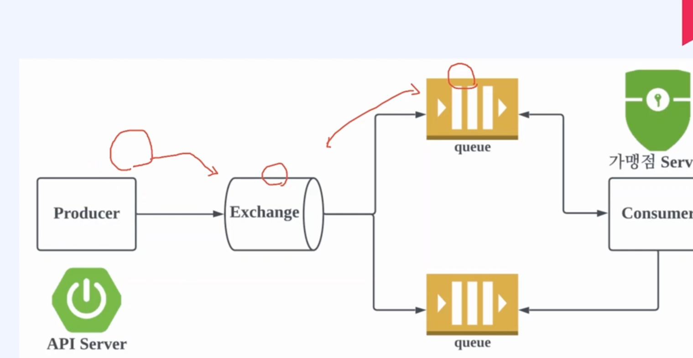

디렉토리 생성
-
  * docker-compose.yaml 을 먼저 생성한다.
  * 생성 이후 안에 설정값을 설정한다
    * 예시) version: '3.7'
      services:
      rabbitmq:
      image: rabbitmq:latest
      ports:
        - "5672:5672" # rabbit amqp port
        - "15672:15672" # manage port

    environment:
      - RABBITMQ_DEFAULT_USER=admin       #기본사용자 이름
      - RABBITMQ_DEFAULT_PASS=admin123!@# # 기본사용자 비밀번호
   
  
그 이후 터미널에서 docker compose up -d 를 실행한다. 
***
마지막으로 docker container 에서 rabbitmq 설치가 된걸 확인 후 Exec 에서 Management 활성화 명령어 실행
-
>rabbitmq-plugins enable rabbitmq_management

잘 실행이 되는걸 확인하려면 먼저 ports에 적어둔 곳을 접속한다. 
 localhost:15672

그리고 확인 후 잘 뜨는지 보자! 
그럼 설치는 여기서 끝
   

그 후에 사용할 곳인 yaml 파일에다가
spring:
rabbitmq:
host: localhost
port: 5672
username: admin
password: admin123!@# 이거를 넣어주면 messageconvert를 사용할수있다.

rabbitmqconfig 파일 참조

exchange 만드는 코드는  rabbitmq에서 제공해주는 DirectExchange를 사용하면되고 
  Queue 또한 rabbitmq 에서 제공하는걸로 만들면됩니다.  
이 두가지를 Binding 을 통해서 합쳐주고 아래와 같은 코드 처럼 해주면 됩니다. 

>import org.springframework.amqp.core.Binding;
import org.springframework.amqp.core.BindingBuilder;
import org.springframework.amqp.core.DirectExchange;

> @Bean
public DirectExchange directExchange(){ 
 return new DirectExchange("delivery.exchange");
 }

    @Bean
    public Queue queue(){
        return new Queue("delivery.queue");
    }

    @Bean
    public Binding binding(DirectExchange directExchange, Queue queue){
        return BindingBuilder.bind(queue).to(directExchange).with("delivery.key");
    }

공통으로 producer를 하나 만들어주면 된다.
delivery/api/common/rabbitmq/Producer.java 
이 경로를 참조하면되는데  common안에 다같이 사용하려고 만들었습니다. 